# Digital Electronic Power Load

<p align="center">
  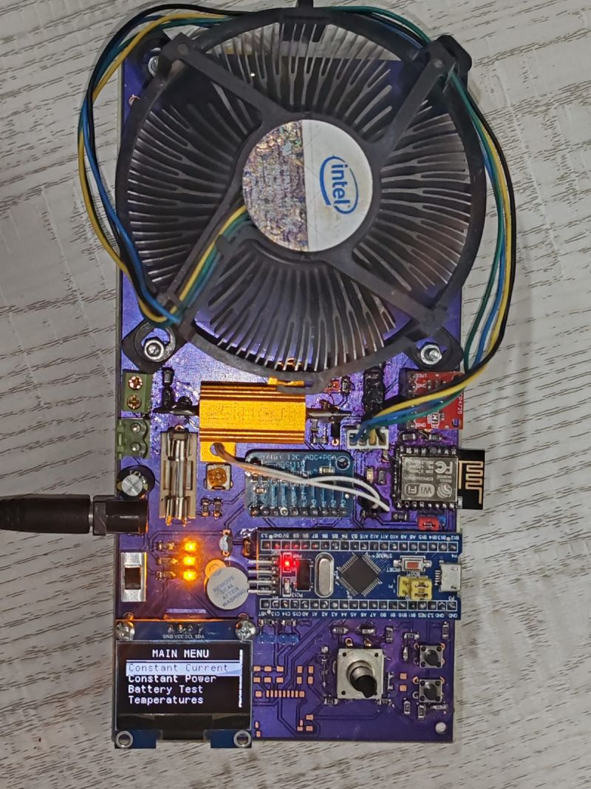
</p>

<p align="center">
  <a href="LICENSE"></a>
  
  
  
</p>

> DC electronic load built around the STM32F103C8 microcontroller. Capable of stress-testing power supplies and batteries.

---

## Table of Contents

- [Project Overview](#project-overview)
- [Hardware Architecture](#hardware-architecture)
- [Schematic Block-by-Block Explanation](#schematic)
- [Firmware Overview](#firmware-overview)
- [Operating Modes](#operating-modes)
- [Calibration System](#calibration-system)
- [Non-Volatile Memory (NVM)](#non-volatile-memory-nvm)
- [Wi-Fi Telemetry Dashboard](#wi-fi-telemetry-dashboard)
- [PC Dashboard Software](#pc-dashboard-software)
- [Getting Started](#getting-started)
- [Project Structure](#project-structure)
- [Bill of Materials](#bill-of-materials)
- [Pin Assignment](#pin-assignment)
- [Specifications](#specifications)
- [Team](#team)
- [License](#license)

---

## Project Overview

The **Digital Electronic Power Load** is designed to operate as an adjustable electrical load that draws a precisely controlled amount of current from a power source under test. while simultaneously displaying voltage, current, power, capacity, and temperature in real time.

---

## Hardware Architecture

```
┌──────────────────────────────────────────────────────────────────┐
│                    INPUT (0–40 V, up to 5 A)                     │
│                        ┌─────────────┐                           │
│                        │  5 A Fuse   │                           │
│                        └──────┬──────┘                           │
│                               │                                  │
│              ┌────────────────┼────────────────┐                 │
│              │                │                │                 │
│   ┌──────────▼───────┐  ┌─────▼──────┐  ┌──────▼──────┐          │
│   │  Voltage Divider │  │  IRFP250N  │  │  1 Ω Shunt  │          │
│   │  (V_SENSOR)      │  │   MOSFET   │  │   Resistor  │          │
│   └──────────┬───────┘  └────────────┘  └──────┬──────┘          │
│              │                                 │                 │
│   ┌──────────▼─────────────────────────────────▼──────────┐      │
│   │              ADS1115 (16-bit ADC, I²C1)               │      │
│   │   CH0: VOLT   CH1: VOLT2   CH2: CURRENT   CH3: ANALOG │      │
│   └───────────────────────────┬───────────────────────────┘      │
│                               │ I²C1                             │
│   ┌───────────────────────────▼─────────────────────────┐        │
│   │               STM32F103C8 @ 72 MHz                  │        │
│   │  TIM2: Encoder   TIM4: Fan PWM    TIM1: Fan Tach    │        │
│   │  ADC1/ADC2: NTC  UART1: ESP8266   I²C2: DAC + OLED  │        │
│   └────┬──────┬──────┬──────┬────────┬────────┬─────────┘        │
│        │      │      │      │        │        │                  │
│      OLED   DAC    Fan   ESP8266  microSD  Buzzer                │
│     (I²C2) (I²C2) (PWM)  (UART1)   (SPI)   (TIM4)                │
└──────────────────────────────────────────────────────────────────┘
```

### Power Stage Detail

The IRFP250N MOSFET operates in its **linear region** as a variable resistor. A **TLV2372IDR op-amp** implements a closed-loop feedback control:

| Op-Amp Input | Signal | Meaning |
|---|---|---|
| V⁺ (non-inverting) | `ANALOG` | DAC reference voltage — the **target** current setpoint |
| V⁻ (inverting) | `FEEDBACK` | Voltage across the 1 Ω shunt resistor — the **actual** current |

The op-amp continuously drives the MOSFET gate until both voltages are equal. This ensures:

```
I_LOAD = V_SHUNT / R_SHUNT = V_FEEDBACK / 1 Ω
```

This elegant 1:1 ratio means **1 V DAC output = 1 A load current**, directly.

---

## Schematic

<p align="center">
  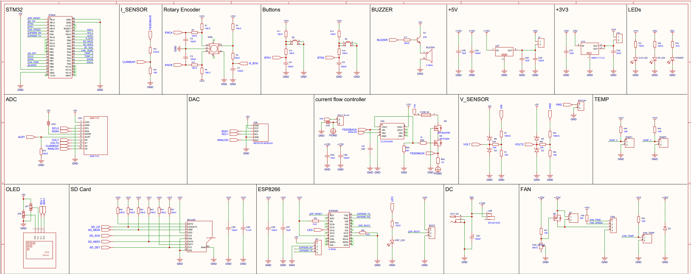
</p>

---

### 1. STM32F103C8 Microcontroller

<p align="left">
  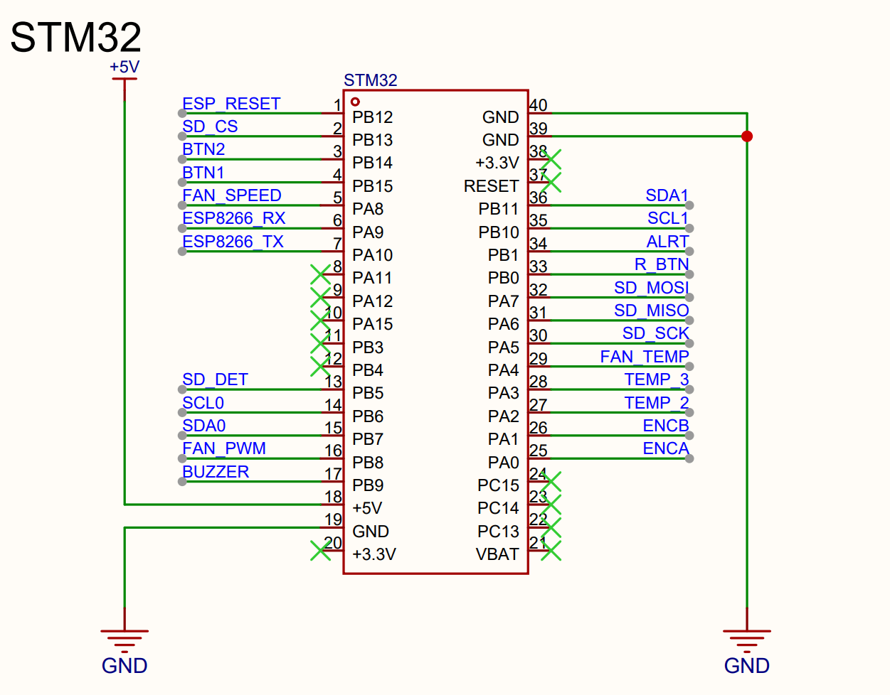
</p>

The **STM32F103C8** is the central control unit. It does **not** directly handle the high load current — instead, it coordinates all other blocks.

| Peripheral | Specification |
|---|---|
| CPU Speed | 72 MHz max |
| Flash Memory | 64 KB |
| SRAM / RAM | 20 KB |
| ADC Resolution | 12-bit (internal) |
| I²C Interfaces | 2 |
| USART / UART | 3 |
| Timers | 7 (3× GP 16-bit + 1× advanced) |
| GPIO Pins | 37 |

---

### 2. Current Flow Controller

<p align="left">
  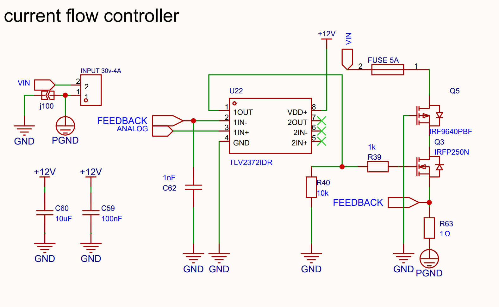
</p>

This is the heart of the load. It consists of:

**MOSFET (IRFP250N):**
- Acts as a variable resistor controlled by its gate voltage
- Dissipates load power as heat

**Op-Amp (TLV2372IDR):**
- Configured as a **voltage-follower comparator** in closed-loop feedback
- V+ = `ANALOG` signal from the MCP4725 DAC (target setpoint)
- V− = `FEEDBACK` signal from the 1 Ω shunt resistor (actual current)
- Drives the MOSFET gate until V+ ≈ V−

**Shunt Resistor (R63, 1 Ω / 25 W):**
- Placed in series with the MOSFET drain
- Produces a voltage proportional to current: `V_SHUNT = I × 1 Ω`
- Since R = 1 Ω, the voltage numerically equals the current in amps

**Protection Fuse (FUSE 5A):**
- Protects the circuit from overcurrent on the main power path

**Load current formula:**
```
I_LOAD = V_ANALOG / R_SHUNT = V_ANALOG / 1 Ω
```

**Gate components:**
- R39 (1 kΩ): Gate series resistor — limits gate current, prevents oscillation
- R40 (10 kΩ): Gate pull-down — ensures MOSFET turns off when op-amp is not driving

---

### 3. Digital-to-Analog Converter (DAC)

<p align="left">
  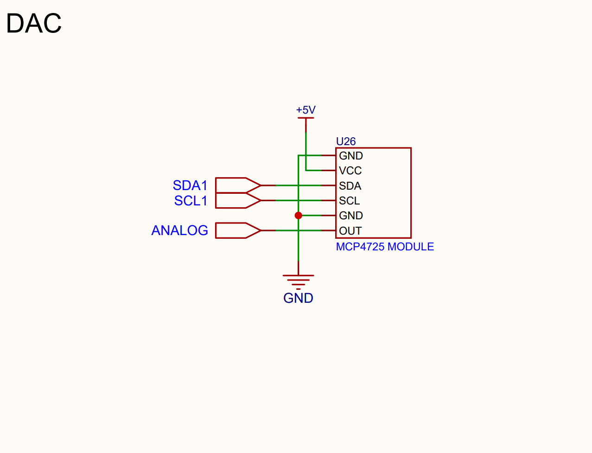
</p>

**Component:** MCP4725 Module 

The MCP4725 is a **12-bit DAC** connected to the STM32 via **I²C2** (SDA1, SCL1). It converts the digital current setpoint into a precise analog reference voltage fed directly into the op-amp's non-inverting input.

| Parameter | Value |
|---|---|
| Resolution | 12-bit (4096 steps) |
| Interface | I²C (SDA1/SCL1) |
| Output Formula | `V_DAC = (D / 4095) × V_REF` |
| Step Size | `V_REF / 4096` per step |
| DAC → Current | 1 V output = 1 A load current |

**C59 (100 nF) and C60 (10 µF):** Decoupling capacitors on the +12 V supply rail that feeds the op-amp, ensuring a stable reference with no switching noise.

**C62 (1 nF):** Placed on the op-amp feedback node. Provides phase compensation to prevent the closed-loop system from oscillating at high frequencies.

---

### 4. Analog-to-Digital Converter (ADC)

<p align="left">
  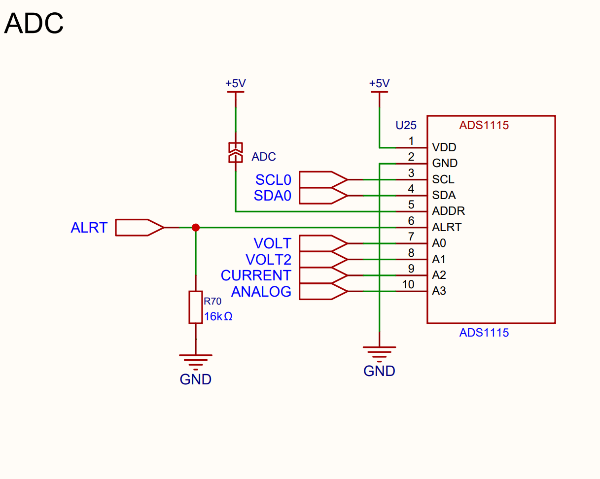
</p>

**Component:** ADS1115 Module

The ADS1115 is a **16-bit, 4-channel ADC** connected to the STM32 via **I²C1** (SDA0, SCL0). It provides far higher resolution than the STM32's built-in 12-bit ADC.

| Channel | Signal | Measures |
|---|---|---|
| A0 (VOLT) | Voltage divider output | Input voltage (channel 1) |
| A1 (VOLT2) | Second voltage divider | Input voltage (channel 2) |
| A2 (CURRENT) | Shunt voltage (scaled) | Load current |
| A3 (ANALOG) | DAC output readback | Current setpoint confirmation |

**Digital code formula:**
```
D = (V_analog × 2^16) / V_REF
```

**Resolution:** `V_REF / 2^16` per step

**ALRT Pin (→ PB1):** The ADS1115 ALERT pin is used to notify the STM32 when a conversion is complete, enabling interrupt-driven ADC reads without polling.

**R70 (16 kΩ):** Since the STM32 PB1 pin operates at a maximum tolerance of 3.3 V, and the ADS1115 ALERT module has an internal/existing 10 kΩ pull-up resistor to +5 V, R70 is configured to act as a voltage divider. This setup safely steps down the 5 V alert output to a level compatible with the 3.3 V logic of the STM32, preventing any over-voltage damage to the microcontroller.

---

### 5. Voltage Sensing

<p align="left">
  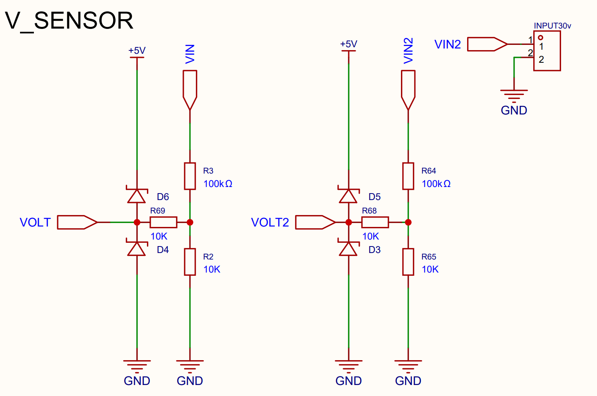
</p>

Since the load can accept up to 40 V but the ADS1115 operates at 5 V, two resistor voltage dividers scale the input voltage to a safe ADC range.

**Divider formula:**
```
V_SENSOR = V_IN × R2 / (R1 + R2)
```

**Component values:**
- R3 / R64 (top): **100 kΩ** each
- R2 / R65 (bottom): **10 kΩ** each
- Scale factor: `10 / (100 + 10) = 1/11` → `V_IN_max = 5 V × 11 = 55 V` maximum input range

**D3–D6 (TVS diodes):** Transient voltage suppression diodes placed at the voltage divider output, clamping any voltage spikes before they can reach the ADS1115 input pins.

**Why two channels (VOLT and VOLT2)?** The firmware uses a dual-channel scheme: VOLT measures the primary input, VOLT2 provides a more accurate reading.

---

### 6. Current Sensing

<p align="left">
  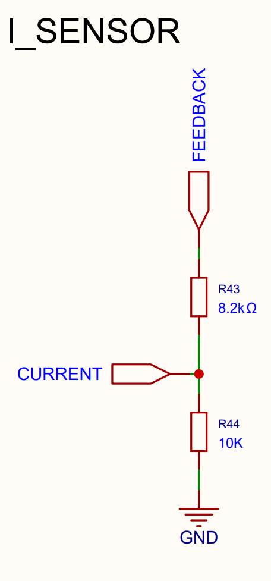
</p>

The load current is sensed via the **1 Ω shunt resistor (R63)**. The voltage across it (`V_SHUNT = I × 1 Ω`) is scaled before reaching the ADS1115 ADC input.

**Scaling network:**
- R43 (8.2 kΩ) + R44 (10 kΩ): Resistor divider scales the FEEDBACK voltage to the ADC's input range
- This same FEEDBACK signal feeds both:
  1. The op-amp's V− input (for closed-loop control)
  2. The ADS1115 channel A2 (for real-time current measurement)

---

### 7. Temperature Monitoring 

<p align="left">
  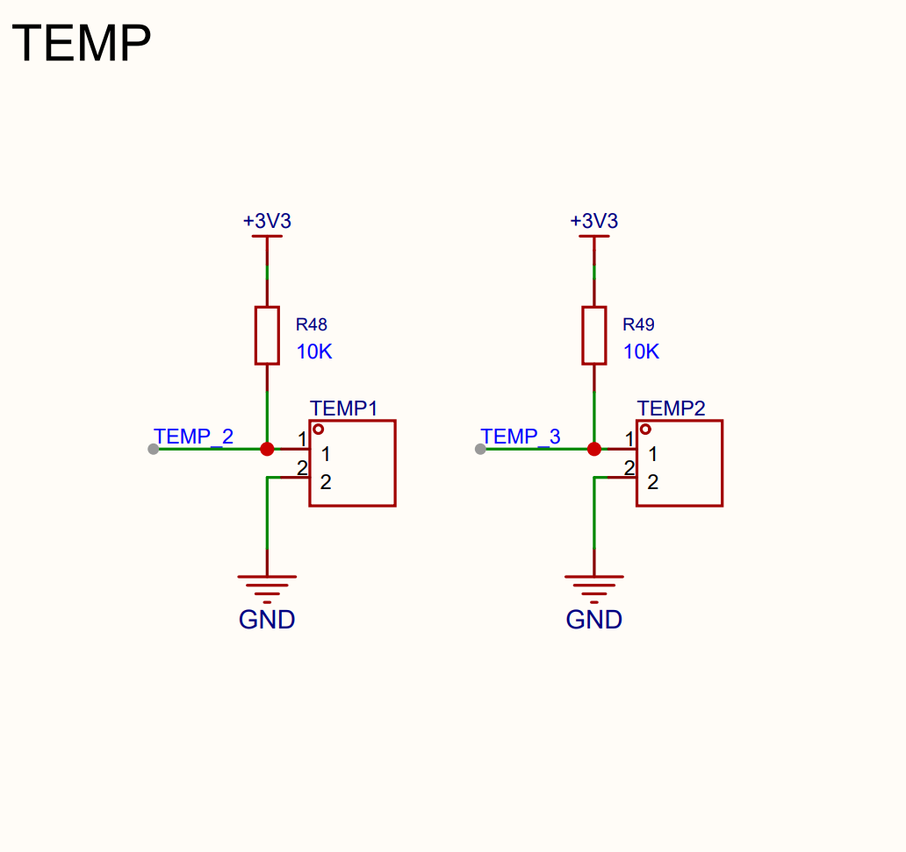
</p>

Three **NTC thermistor circuits** (FAN_TEMP, TEMP1, TEMP2) are used for thermal monitoring. **TEMP1** and **TEMP2** are dedicated to measuring the temperature of the power source being tested, while **FAN_TEMP** monitors the heat near the fan heatsink. Each thermistor forms a voltage divider with a fixed resistor against the +3.3 V rail.

| Channel | NTC Label | Location | STM32 Pin |
|---|---|---|---|
| TEMP_1 | TEMP1 | Power Source (Device Under Test) | PA2 (ADC2) |
| TEMP_2 | TEMP2 | Power Source (Device Under Test) | PA3 (ADC3) |
| FAN_TEMP | FAN_TEMP | Fan heatsink | PA4 (ADC4) |

**NTC Parameters:**
```c
#define NTC_PULLUP_OHMS    9100.0f    // Series pull-up resistor
#define NTC_NOMINAL_OHMS  100000.0f  // 100 kΩ at 25°C
#define NTC_BETA           3435.0f   // Steinhart–Hart β coefficient
```

**Temperature to resistance (Steinhart–Hart B-parameter equation):**
```
1/T = 1/T0 + (1/B) × ln(R / R0)
```

**Firmware actions on over-temperature:**
1. Below 35°C → Fan stays at minimum speed or off
2. 35°C–65°C → Fan speed scales proportionally (PWM duty cycle)
3. Above 65°C → Fan runs at full speed
4. Critical threshold exceeded → Load shut down automatically

---

### 8. Fan and Cooling System

<p align="left">
  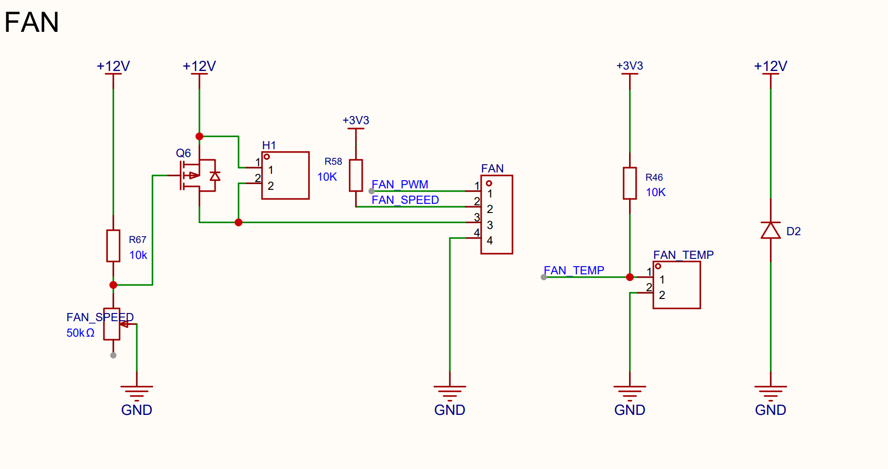
</p>

**Fan Driver Circuit:**
- **Q6 (IRF9640PBF P-MOSFET):** High-side switch for the +12 V fan supply
- **R67 (10 kΩ):** Gate pull-down for Q6
- **D2:** Flyback diode protecting the MOSFET when the inductive fan load switches

**Fan Speed Sensing (Tach Pulse):**
- `FAN_SPEED` signal connects to PA8 (TIM1_CH1) as a timer input capture
- The fan generates 2 tach pulses per revolution
- STM32 counts pulses over a 1-second window to calculate RPM

**Fan Speed Range:**
```c
#define FAN_TEMP_MIN_C    35.0f   // Fan starts spinning
#define FAN_TEMP_MAX_C    65.0f   // Fan at full speed
#define FAN_PWM_MIN       800     // Minimum duty cycle
#define FAN_PWM_MAX      2880     // Maximum duty cycle (full speed)
```

**Manual Override:** The fan control screen allows the operator to switch from automatic thermal control to a manual percentage setting.

---

### 9. OLED Display 

<p align="left">
  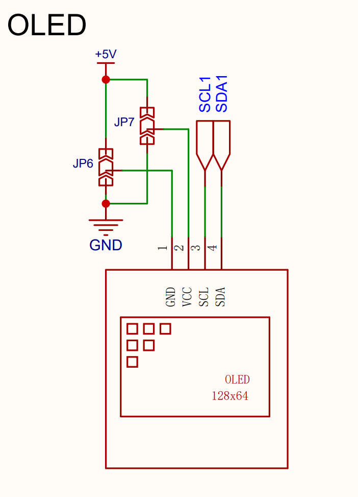
</p>

**Component:** SSD1306 128×64 OLED 

Connected to the STM32 via **I²C2** (shared with the MCP4725 DAC on SDA1/SCL1 with different I²C addresses).

**Displayed information:**
- Load current (A)
- Input voltage (V)
- Power consumption (W)
- Accumulated capacity (mAh) — Battery Discharge Mode
- Temperatures (°C)
- Fan speed (RPM)

**JP6 / JP7:** Jumper pads for I²C address selection (OLED typically at 0x3C, DAC at 0x62).

**Display refresh rate:** 250 ms during active load run, ~500 ms in menu navigation.

---

### 10. Rotary Encoder and Buttons

<p align="left">
  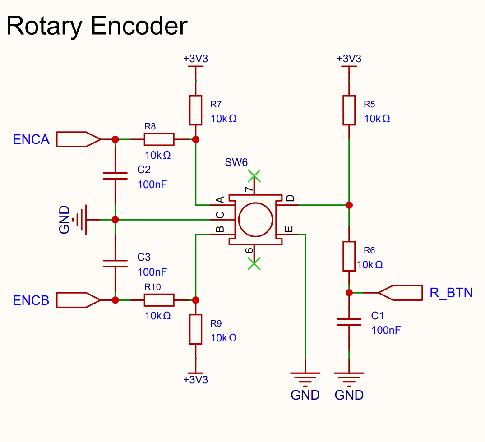
  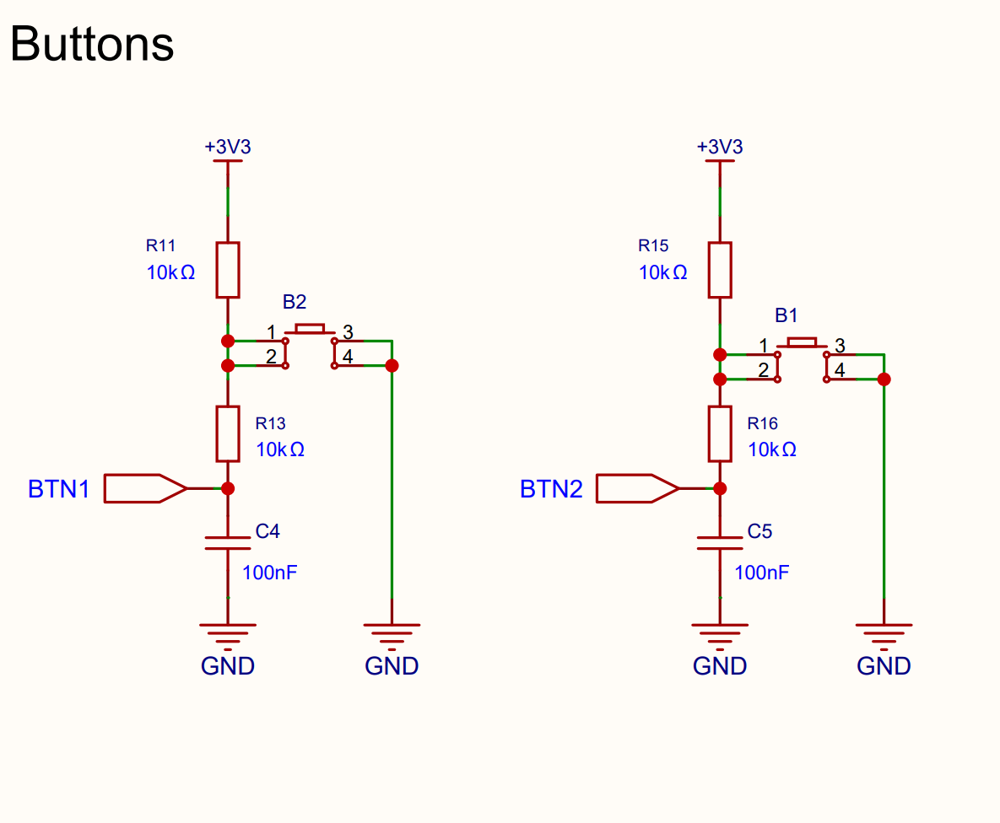
</p>

**Rotary Encoder (SW6, EC11):**
- ENCA → PA0 (TIM2_CH1), ENCB → PA1 (TIM2_CH2)
- Hardware quadrature decode via STM32 TIM2 encoder mode
- Encoder push-button → PB0 (R_BTN), internal pull-up, active-low
- R7, R8, R9, R10 (10 kΩ each): Pull-up resistors on encoder signals
- C2, C3 (100 nF each): Debounce capacitors on encoder channels

**Tactile Buttons (B1, B2):**
- BTN1 → PB15 (left/back), BTN2 → PB14 (right/confirm)
- Internal pull-ups enabled, active-low
- R11, R15, R13, R16 (10 kΩ): External pull-ups
- C4, C5 (100 nF): Hardware debounce

**Software debounce:** Additional 400 ms debounce timer in firmware (`DEBOUNCE_MS = 400`).

---

### 11. ESP8266 Wi-Fi Module

<p align="left">
  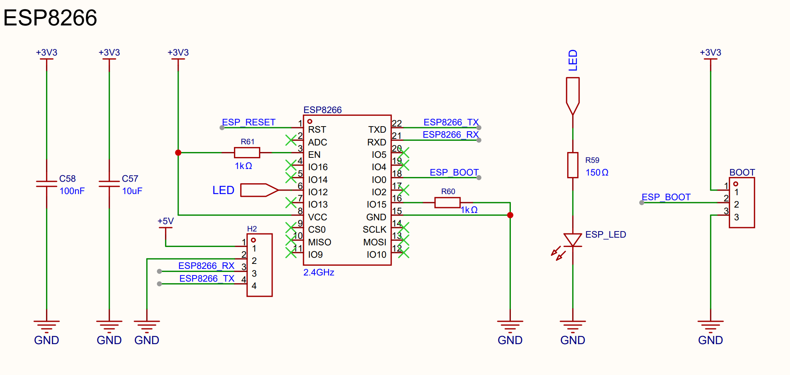
</p>

The ESP8266 provides Wi-Fi connectivity for real-time telemetry streaming.

**Interface to STM32:**
- PA9 (UART1 TX) → ESP8266 RXD: STM32 sends telemetry data
- PA10 (UART1 RX) ← ESP8266 TXD: ESP sends back its IP address
- PB12 → ESP_RESET: Active-low reset line (STM32 can reboot the ESP)
- Baud rate: **115200 bps**

**Decoupling capacitors:**
- C57 (10 µF) + C58 (100 nF): Bulk and HF decoupling on the ESP8266 +3.3 V supply — essential because the ESP draws large current spikes (~300 mA) during Wi-Fi transmission

**R59 (150 Ω) + ESP_LED:** Visual indicator for ESP8266 activity.

**BOOT header (3-pin):** Allows pulling IO0 LOW for firmware update mode without soldering.

**H2 (4-pin header):** Alternative UART access connector — `ESP8266_RX`, `ESP8266_TX`, `GND`, `+5V`.

**Wi-Fi Modes:**
- **Station Mode:** Connects to existing Wi-Fi network. IP shown on OLED.
- **Access Point Mode:** Creates `DC_LOAD_SETUP` network when no credentials are saved. Web config page served at `192.168.4.1`.

---

### 12. MicroSD Card 

**Component:** MicroSD socket (SPI mode)

Connected to STM32 via SPI with dedicated chip-select:

| Signal | STM32 Pin | Notes |
|---|---|---|
| SD_SCK | — (SPI CLK) | SPI clock |
| SD_MOSI | — (SPI MOSI) | Data to card |
| SD_MISO | — (SPI MISO) | Data from card |
| SD_CS | PB13 | Chip select (active-low) |
| SD_DET | PC13 | Card detect switch |

- R52–R57 (10 kΩ each): Pull-up resistors on all SPI lines — required by the SD specification in SPI mode
- C55 (4.7 µF) + C56 (100 nF): Decoupling on the SD card's 3.3 V supply
- Data is written as **CSV** with timestamp, voltage, current, power, temperature

---

### 13. Buzzer 

<p align="left">
  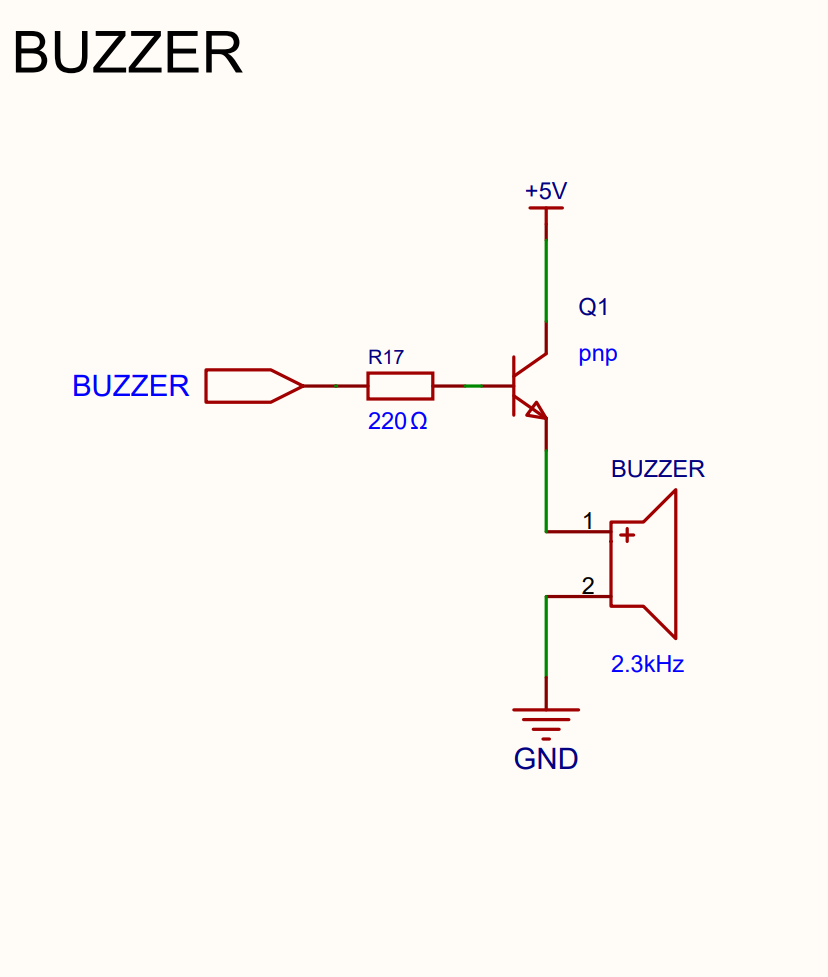
</p>

**Component:** Passive buzzer, 2.3 kHz resonant frequency

- Q1 (PNP transistor): Drives the buzzer coil from the +5 V rail
- R17 (220 Ω): Base current limiting resistor for Q1

**Uses:**
- Single short beep: button press confirmation
- Double beep: alarm condition (over-temperature, fan stall)
- Continuous tone: critical shutdown event

---

### 14. Power Supply 

**Input:** 12 V / 1.5 A DC barrel jack
Powers: op-amp, fan

**5 V Rail (U27, 78M05-class LDO):**
- Powers: buzzer driver, ADS1115, STM32F103, MCP4725 DAC, SSD1306 OLED
- C48 (10 µF) input, C49 (100 nF) HF bypass, C50 (10 µF) output

**3.3 V Rail (U14, AMS1117-3.3):**
- Powers: ESP8266, microSD
- C47 (10 µF) input, C42 (22 µF) output for stability

**Power LEDs:**
- 12V LED: Indicates 12 V rail is active
- 5V LED: Indicates 5 V rail is active
- 3.3V LED: Indicates 3.3 V rail is active

---

## Firmware Overview

The firmware (`Core/Src/main.c`, v4.1) is written in **bare-metal C** using the STM32 HAL. All logic runs in a single super-loop — no RTOS required.

### Service Timing Table

| Service | Interval | Function |
|---|---|---|
| `Sensor_ServiceADS1115` | 2 ms | ADC state machine — alternates voltage/current reads |
| `Sensor_ServiceTemperatures` | 1 s | Reads 3 NTC thermistors via STM32 internal ADC |
| `Sensor_ServiceFanRPM` | 1 s | Counts tach pulses from TIM1 |
| `Thermal_ServiceFan` | 500 ms | Adjusts fan PWM (auto/manual mode) |
| `Thermal_ServiceFanAlarm` | continuous | Double-beep alarm if fan stalls at high temp |
| `Load_UpdateDAC` | every loop | Computes and writes DAC setpoint |
| `Load_ServiceCapacity` | 1 s | mAh accumulation + battery cutoff check |
| `UART_SendData` | 500 ms | CSV telemetry packet to ESP8266 |
| `Encoder_Service` | every loop | Quadrature encoder delta detection |
| `Display_Refresh` | 250 ms (running) | SSD1306 screen redraw |
| `NVM_Save` | 60 s (battery test) | Auto-saves capacity to Flash |

### Screen State Machine

```
SCREEN_MODE_SELECT
       │
       ▼ (select CC / CP / Battery)
SCREEN_SUBMENU ─── "Set Value" ────► SCREEN_SET_VALUE
       │                                     │
       │                  "Start" ───────────►│
       │                                     ▼
       │                              SCREEN_RUNNING
       │                                     │
       │                          (encoder btn)│
       │                                     ▼
       └────────────────────────────  SCREEN_SUBMENU

SCREEN_MODE_SELECT ──► SCREEN_TEMPERATURES
                   ──► SCREEN_FAN_CONTROL
                   ──► SCREEN_CALIBRATION ──► SCREEN_CAL_ENTRY
                   ──► SCREEN_WIFI
```

### Telemetry Format (UART → ESP8266)

```
index,voltage,current,fan_temp,temp1,temp2\n
```
Example: `142,12.350,2.500,45.60,31.20,30.80`

Sent every **500 ms** while the load is in `SCREEN_RUNNING`.

---

## Operating Modes

### Constant Current (CC)

Sets a fixed current from **0.000 to 5.000 A** (1 mA resolution). The op-amp feedback loop maintains this current regardless of input voltage fluctuation.

```c
// DAC value computation
dac = (target_mA * 4095) / 5000;
```

### Constant Power (CP)

Sets a fixed power from **0 to 200 W**. The firmware recalculates the required current in real time based on measured voltage:

```c
target_mA = (power_mW * 1000UL) / voltage_mV;
```

### Battery Discharge Test

Discharges a battery at a user-set constant current until:
- Voltage drops below a **programmable cutoff** (2.5 V – 4.2 V adjustable)

**Key features:**
- Accumulated mAh auto-saved to Flash **every 60 seconds**
- **Power-loss resume:** Next boot detects an in-progress test and resumes from saved mAh value
- **Cutoff precision:** 5 V / 2¹⁶ ≈ 0.076 mV voltage resolution ensures accurate cutoff detection

---

## Calibration System

Accessible via **Main Menu → Calibration**.

### Method A: True Value Entry

Connect a known load. OLED shows the current raw reading. Enter the true value from your multimeter. Firmware computes:

```
new_scale = true_value / raw_ADC_reading
```

### Method B: Component-Level (Resistor)

**Voltage channels:** Enter R_top and R_bot of the divider (kΩ):
```
scale = (R_top + R_bot) / R_bot
```

**Current channel:** Enter shunt resistance (mΩ) and amplifier gain:
```
scale = 1000 / (shunt_mΩ × gain)
```

### Default Calibration Constants

```c
#define VOLT1_CAL_DEFAULT   6.1648f   // V1 scale factor (raw ADS voltage → real V)
#define VOLT2_CAL_DEFAULT   6.1648f   // V2 scale factor
#define CURR_CAL_DEFAULT    1.1098f   // Current scale factor (raw ADS → A)
```

All calibration values are saved to Flash and survive power cycles. A **"Reset Defaults"** option restores compile-time constants.

---

## Non-Volatile Memory (NVM)

Stored in the **last Flash page** of the STM32F103C8 at address `0x0800F800` (1 KB page):

```c
typedef struct {
    uint32_t magic;               // 0xDEADBEEF — validity marker
    uint32_t capacity_mAh;        // Last battery test capacity
    uint32_t mAh_milli;           // Fractional mAh × 1000
    uint32_t dischargeCurrent_mA;
    uint32_t cutoffVoltage_mV;
    uint32_t testFlags;           // bit0 = running, bit1 = finished
    uint32_t volt1Scale_x1000;    // Calibration scales (× 1000 for integer storage)
    int32_t  volt1Offset_mV;
    uint32_t volt2Scale_x1000;
    int32_t  volt2Offset_mV;
    uint32_t currScale_x1000;
    int32_t  currOffset_mA;
    uint32_t checksum;            // Additive checksum of all preceding words
} NvmData_t;                      // Total: 52 bytes
```

**NVM is written:**
- Manually via **Calibration → Save to Flash**
- Automatically every **60 seconds** during a battery test
- Immediately on **battery cutoff**

**NVM is validated** on every boot using the magic number and additive checksum. Corrupted NVM is silently replaced with defaults.

---

## Wi-Fi Telemetry Dashboard

The ESP8266 firmware (`tools/esp8266_firmware/esp8266.ino`) acts as a TCP server on port **8080**. It stores incoming telemetry in RAM (up to 1000 records) and on **LittleFS** for persistent storage in case the physical MicroSD card is not inserted.

### Connection Protocol

```
Client → ESP:  SYNC:INDEX\n          (request data from record INDEX)
ESP → Client:  idx,v,i,fan_t,t1,t2\n (stream CSV records)
Client → ESP:  RESET\n               (clear buffer, restart index)
```

### Data Record Structure (Binary, on-disk)

```c
struct SensorRecord {
    uint32_t index;   // Sequential record number
    float    voltage; // Input voltage (V)
    float    current; // Load current (A)
    float    fanTemp; // Fan heatsink temperature (°C)
    float    temp1;   // Temperature sensor 1 (°C)
    float    temp2;   // Temperature sensor 2 (°C)
};  // 24 bytes per record
```

### ESP8266 Wi-Fi Setup

On first boot (no credentials saved), the ESP creates a Wi-Fi access point named `DC_LOAD_SETUP`. Connect and navigate to `192.168.4.1` to enter your router's SSID and password. Credentials are saved to LittleFS and survive power cycles.

---

## PC Dashboard Software

<p align="center">
  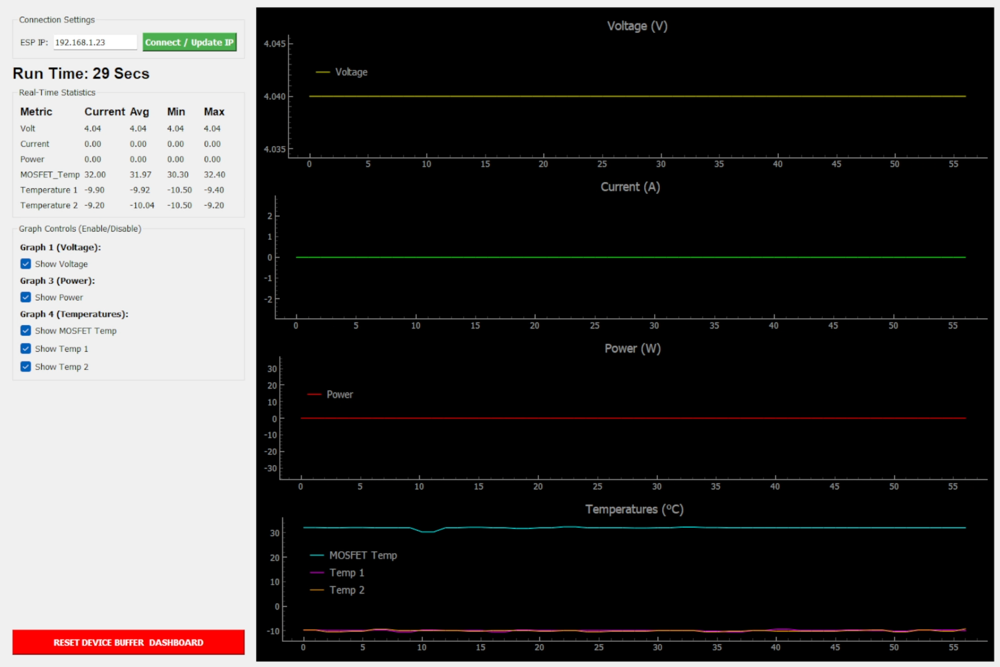
</p>

The Python Qt dashboard (`tools/pc_dashboard/graph.py`) connects to the ESP8266 over TCP and displays live graphs.

### Features

- **4 real-time graphs:** Voltage (V), Current (A), Power (W), Temperatures (°C)
- **Live statistics:** Current / Average / Min / Max for all channels
- **Graph toggles:** Enable or disable individual traces
- **Run-time counter:** Switches from seconds to minutes after 10 minutes
- **Reset button:** Clears ESP8266 buffer and dashboard simultaneously

### Running the Dashboard

```bash
# Install dependencies
pip install pyqt5 pyqtgraph numpy

# Run
python tools/pc_dashboard/graph.py
```

Enter the ESP8266 IP address (shown on OLED display) and click **Connect / Update IP**.

---

## Getting Started

### Prerequisites

- **STM32CubeIDE** (v1.12+) or **Keil MDK**
- **STM32CubeProgrammer** for flashing
- **ST-Link V2** (or compatible SWD debugger)
- **Arduino IDE** with ESP8266 board package (for ESP firmware)
- **Python 3.8+** with `pyqt5`, `pyqtgraph`, `numpy` (for PC dashboard)

### 1. Flash the STM32

```bash
# Clone the repository
git clone https://github.com/abdelrhman1040/digital-electronic-power-load.git
cd digital-electronic-power-load

# Option A: STM32CubeIDE
#   File → Import → Existing Projects into Workspace → Select repo root
#   Build (Ctrl+B) → Flash via Run → Debug Configurations → ST-Link

# Option B: Command line with st-flash
make -C Core/Build all
st-flash write Core/Build/digital-power-load.bin 0x08000000
```

### 2. Flash the ESP8266

```bash
# Open tools/esp8266_firmware/esp8266.ino in Arduino IDE
# Board: ESP8266 (e.g., NodeMCU 1.0)
# Upload speed: 115200
# Flash size: 4MB
# Upload
```

### 3. Connect Hardware

1. Connect 12 V DC to the barrel jack
2. Connect load source to screw terminals (INPUT 40v-5A)
3. Power OLED shows the **MAIN MENU**
4. Navigate with rotary encoder, confirm with push-button

### 4. Wi-Fi Setup (First Boot)

1. Connect phone/laptop to `DC_LOAD_SETUP` Wi-Fi network
2. Browse to `192.168.4.1`
3. Enter your router SSID + password, click Save
4. ESP reboots and connects → IP shown on OLED Wi-Fi screen

### 5. Run PC Dashboard

```bash
python tools/pc_dashboard/graph.py
# Enter IP from OLED → Connect / Update IP
```

---

## 📁 Project Structure

```
digital-electronic-power-load/
│
├── Core/
│   ├── Inc/
│   │   ├── ads1115.h                     # 16-bit ADC I²C driver header
│   │   ├── encoder.h                     # Rotary encoder header
│   │   ├── fonts.h                       # Font definitions for OLED
│   │   ├── main.h                        # Pin definitions, HAL includes
│   │   ├── mcp4725.h                     # 12-bit DAC I²C driver header
│   │   ├── ssd1306.h                     # OLED I²C driver header
│   │   ├── stm32f1xx_hal_conf.h          # HAL module selection
│   │   └── stm32f1xx_it.h                # Interrupt service routines header
│   └── Src/
│       ├── ads1115.c                     # 16-bit ADC I²C driver source
│       ├── encoder.c                     # Rotary encoder source
│       ├── fonts.c                       # Font definitions source
│       ├── main.c                        # Main firmware
│       ├── mcp4725.c                     # 12-bit DAC I²C driver source
│       ├── ssd1306.c                     # OLED I²C driver source
│       ├── stm32f1xx_hal_msp.c           # MSP peripheral init callbacks
│       ├── stm32f1xx_it.c                # Interrupt service routines
│       ├── syscalls.c                    # System calls
│       ├── sysmem.c                      # System memory management
│       └── system_stm32f1xx.c            # CMSIS Cortex-M3 Device Peripheral Access Layer
│  
├── hardware/
│   ├── schematic/
│   │   ├── Schematic.pdf                 # Full EasyEDA schematic export 
│   │   └── Schematic.png                 # Schematic image for README     
│   ├── pcb/
│   │   └── PCB_Layout.png                # PCB image for README          
│   └── bom/
│       └── BOM.csv                       # Bill of materials
│
├── tools/
│   ├── pc_dashboard/
│   │   └── graph.py                      # PyQt5 live telemetry dashboard
│   └── esp8266_firmware/
│       └── esp8266.ino                   # ESP8266 TCP server + LittleFS
│
├── Images/
│   ├── dashboard.png                     # Dashboard screenshot           
│   ├── pcb_photo.jpg                     # PCB design/layout photo            
│   ├── project_photo.jpg                 # Assembled hardware photo                  
│   └── schematic/
│       ├── +3V3.png                      # 3.3V power supply schematic
│       ├── +5V.png                       # 5V power supply schematic
│       ├── ADC.png                       # ADC block schematic
│       ├── Buttons.png                   # Push buttons schematic
│       ├── BUZZER.png                    # Buzzer schematic
│       ├── current_flow_controller.png   # Current flow controller schematic
│       ├── DAC.png                       # DAC block schematic
│       ├── DC.png                        # DC power input schematic
│       ├── ESP8266.png                   # ESP8266 module schematic
│       ├── FAN.png                       # Cooling fan schematic
│       ├── I_SENSOR.png                  # Current sensor schematic
│       ├── LEDs.png                      # Indicator LEDs schematic
│       ├── OLED.png                      # OLED display schematic
│       ├── power_stage.png               # Main power stage schematic
│       ├── Rotar_Encoder.png             # Rotary encoder schematic
│       ├── Schematic.png                 # Full schematic overview
│       ├── SD_Card.png                   # SD Card module schematic
│       ├── STM32.png                     # STM32 microcontroller schematic
│       ├── TEMP.png                      # Temperature sensor schematic
│       └── V_SENSOR.png                  # Voltage sensor schematic
│
├── media/
│   └── demo_video.mp4                    # Project demo video             
│
├── .gitignore
├── LICENSE
└── README.md
```

---

## Bill of Materials

| Ref | Component | Value / Part | Qty | Notes |
|---|---|---|---|---|
| U1 | Microcontroller | STM32F103C8T6 | 1 | Blue Pill board or custom PCB |
| U22 | Op-Amp | TLV2372IDR | 1 | Dual rail-to-rail, SO-8 |
| U25 | ADC | ADS1115 Module | 1 | 16-bit, 4-ch, I²C |
| U26 | DAC | MCP4725 Module | 1 | 12-bit, I²C |
| U14 | LDO Regulator | AMS1117-3.3 | 1 | 3.3 V rail, SOT-223 |
| U27 | LDO Regulator | 7805 / LM2596 | 1 | 5 V rail |
| U28 | Ideal Diode | SS12D10G5 | 1 | Input polarity protection |
| Q3 | N-MOSFET (load) | IRFP250N | 1 | TO-247, mounted on heatsink |
| Q5 | P-MOSFET (fan) | IRF9640PBF | 1 | Fan high-side switch |
| Q6 | N-MOSFET (fan) | IRFZ44N | 1 | Low-side PWM fan driver |
| Q1 | PNP Transistor | General purpose | 1 | Buzzer driver |
| OLED | OLED Display | SSD1306 128×64 | 1 | I²C, 0x3C address |
| ESP1 | Wi-Fi Module | ESP8266 | 1 | 2.4 GHz, UART interface |
| SD1 | MicroSD Socket | MicroSD | 1 | SPI mode |
| SW6 | Rotary Encoder | EC11 | 1 | With integrated push-button |
| B1, B2 | Tactile Button | 6×6 mm | 2 | Momentary push |
| BUZZ | Buzzer | 2.3 kHz passive | 1 | Passive type |
| R63 | Shunt Resistor | 1 Ω / 5 W | 1 | Current sense, wirewound |
| R3, R64 | Voltage Divider (top) | 100 kΩ | 2 | V_SENSOR scaling |
| R2, R65 | Voltage Divider (bot) | 10 kΩ | 2 | V_SENSOR scaling |
| R43 | I_SENSOR scaling | 8.2 kΩ | 1 | Current divider |
| R44 | I_SENSOR scaling | 10 kΩ | 1 | Current divider |
| R40 | MOSFET gate pull-down | 10 kΩ | 1 | Ensures MOSFET off at idle |
| R39 | MOSFET gate series | 1 kΩ | 1 | Oscillation prevention |
| C1–C5 | Decoupling | 100 nF | 5 | Encoder/button noise filter |
| C42 | Bulk capacitor | 22 µF | 1 | 3.3 V rail output |
| C47, C50 | Bulk capacitor | 10 µF | 2 | 3.3 V / 5 V rails |
| C59 | HF bypass | 100 nF | 1 | +12 V rail decoupling |
| C60 | Bulk capacitor | 10 µF | 1 | +12 V rail bulk |
| C61 | Input bulk | 100 µF | 1 | Main input transient storage |
| C62 | Compensation | 1 nF | 1 | Op-amp loop stability |
| LED1 | Power indicator (3.3 V) | Green LED | 1 | R31 = 150 Ω |
| LED2 | Power indicator (5 V) | Green LED | 1 | R29 = 330 Ω |
| FUSE | Input fuse | 5 A | 1 | Main input protection |
| NTC1–3 | Thermistors | 100 kΩ NTC | 3 | β = 3435, MOSFET heatsink |
| J100 | DC Jack | Barrel 5.5/2.1 mm | 1 | 12 V / 1.5 A input |

---

## Pin Assignment

Full STM32F103C8 pin mapping:

| STM32 Pin | Signal | Direction | Mode | Notes |
|---|---|---|---|---|
| PA0 | ENCA (TIM2_CH1) | Input | Floating | Rotary encoder channel A |
| PA1 | ENCB (TIM2_CH2) | Input | Floating | Rotary encoder channel B |
| PA2 | TEMP_1 (ADC2) | Input | Analog | NTC thermistor 1 |
| PA3 | TEMP_2 (ADC3) | Input | Analog | NTC thermistor 2 |
| PA4 | FAN_TEMP (ADC4) | Input | Analog | Fan heatsink NTC |
| PA8 | FAN_SPEED (TIM1_CH1) | Input | Floating | Fan tach — 2 pulses/rev |
| PA9 | ESP8266_RX (UART1_TX) | Output | AF push-pull | STM32 TX → ESP RX |
| PA10 | ESP8266_TX (UART1_RX) | Input | Floating | ESP TX → STM32 RX |
| PB0 | R_BTN | Input | Pull-up | Encoder push-button (active-low) |
| PB1 | ALRT (ADC9) | Input | Floating | ADS1115 ALERT pin |
| PB6 | SCL0 (I²C1_SCL) | Output | AF open-drain | ADS1115 clock |
| PB7 | SDA0 (I²C1_SDA) | Bidir. | AF open-drain | ADS1115 data |
| PB8 | FAN_PWM (TIM4_CH3) | Output | AF push-pull | 25 kHz fan PWM |
| PB9 | BUZZER (TIM4_CH4) | Output | AF push-pull | PWM buzzer tone |
| PB10 | SCL1 (I²C2_SCL) | Output | AF open-drain | OLED + DAC clock |
| PB11 | SDA1 (I²C2_SDA) | Bidir. | AF open-drain | OLED + DAC data |
| PB12 | ESP_RESET | Output | GP push-pull | Active-low ESP reset |
| PB13 | SD_CS | Output | GP push-pull | MicroSD chip select |
| PB14 | BTN2 | Input | Pull-up | Right button (confirm) |
| PB15 | BTN1 | Input | Pull-up | Left button (back) |
| PC13 | SD_DET | Input | Pull-up | MicroSD card detect |

---

## Specifications

| Parameter | Value |
|---|---|
| Input Voltage | 0 – 40 V DC |
| Maximum Current | 5 A continuous |
| Maximum Power | ~200 W (heatsink-dependent) |
| Voltage Resolution | ~0.61 mV (16-bit ADC, 6.16× divider scale) |
| Current Resolution | ~1.22 mA (16-bit ADC, 1.11× scale) |
| DAC Current Step | ~1.22 mA (12-bit, 0–5 A range) |
| Fan Control | 25 kHz PWM, proportional 35–65 °C |
| Fan Speed Sensing | Tach pulse counting, 2 pulses/rev |
| UART Baud Rate | 115200 bps |
| TCP Port | 8080 |
| NVM Size | 52 bytes (last STM32 Flash page) |
| Data Logging | Up to 6 continuous days at 500 ms rate |
| Operating Supply | 12 V / 1.5 A DC barrel jack (5.5 mm) |
| Logic Supply | 3.3 V (AMS1117-3.3) + 5 V (LM78M05) |

---

### PCB Design

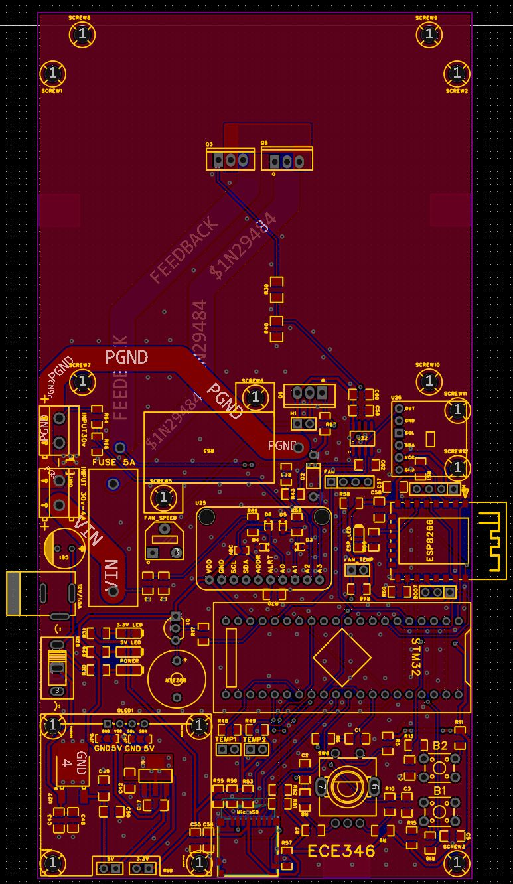

### Demo Video


---

## License

This project is released under the [GNU General Public License](LICENSE). See the `LICENSE` file for full terms.

